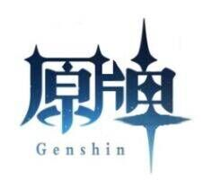

# README



# 项目介绍

　　原牌 Genpai 是一个网络合作项目，于 2021 年 11 月 28 日立项。

　　原牌立项的核心目标是让收到秋招感谢信项目组成员能在即将到来的春招中取得理想的 offer。项目的基本目标为设计一款原神的同人卡牌游戏，并引入卡牌游戏中绝无仅有的元素战斗系统，以及 PVPVE 的全新博弈模式。

　　该 git 页面为原牌项目的程序开发版本管理器

- 目录结构
- 需求结构
- 开发规范

# 目录结构

（这windows的tree不太好用就手打了）

* Assets：存放项目的主要文件
  * Prefabs：用于存放组件模板
  * Resources：用于存放动态数据和模型（供 Resources 类调用
  * Scenes：用于存放构建场景
  * Scripts：用于存放**代码文件**
  * UI Elements：用于存放静态 UI 数据（待修改，目前仅导入方便场景构建使用的包
* DataScripts：存放策划表，以及将策划表格导入程序的脚本
  * 已存有初版卡牌数据，待整理
* doc：测试&其它说明文档
* Packages、ProjectSettings、UserSettings：Unity 自动生成文件

## 代码结构说明（随开发进程整理）

详细代码结构见[程序文档](doc/html/index.html)

现在描述程序主要开发目录结构

* Card：（待收纳）为基础的卡牌类相关，作用域为整个游戏机制（包含组建卡组）
* DataLoader：数据读取器
  * 目前仅有卡牌读取器 CardLoader
  * 后续开发流程会更新技能读取器等（与策划交接）
  * 待确定美术资源是否也用读取器预读
* GameMain：（待更名）卡牌战斗相关代码，游戏核心模块
  * BattleField：战场相关模块
    * Bucket：格子类，管理游戏中单个可部署格子信息
  * Card：卡牌相关模块
    * CardDeck：牌库管理器
    * CardLibrary：牌组管理器（待实现
    * CardOnHand：手牌行为脚本
  * Common：游戏通用模块
    * Constants：（待整理）常用枚举字段合集
    * GameContext：游戏上下文管理器
  * Effect：效果实现模块（实现所有游戏行为，包括攻击、技能、伤害造成、Buff 追加等）
    * Buff：Buff 实现（非初版任务
    * Skill：技能实现（非初版任务
    * Healing：恢复实现（非初版任务
    * Damage：伤害实现*
    * IEffect：效果接口
  * GameManager：战斗管理器模块（通过消息系统对玩家行为触发脚本进行反馈）
    * AttackManager：攻击管理器，实现玩家从点击单位生成攻击请求到确认目标实现的过程
    * SummonManager：召唤管理器，实现玩家从点击卡牌生成召唤请求到确认地块实现的过程
    * EffectManager：效果管理器，实现玩家造成对目标效果的结算（可进一步细分）
    * DamageCalculator：伤害计算器，管理伤害计算过程
    * BattleFieldManager：战场管理器，实现战场中格子单位绑定、解绑，UI 反馈高亮等事件
  * Player：玩家实现模块：掌握玩家数据，被上下文管理器所控制
  * Process：游戏进程模块：掌握游戏进程循环，被上下文管理器所控制，在进程中发布特定消息
  * UI：UI 链接脚本，MonoBehaviors，实现 UI 组件的显示及更新，接收战斗管理器的消息
  * Unit：战斗单位模块
    * Unit：基准单位类
    * UnitEntity：单位实体mono脚本
    * CharaEntity：继承UnitEntity，实现角色功能
    * BossEntity：继承UnitEntity，实现Boss功能
    * CharaBanner: 角色侧栏交互，实现角色出场
* Utils：工具集（待补充）
  * Messager：消息管理器
  * Singleton：单例类，游戏中使用到单例统一实现形式

# 需求结构

## 根据游戏进程整理

游戏全局

* 卡牌
  * [卡牌的显示](https://www.teambition.com/project/61a89798beaeab07a42c799c/works/61c5cc58f516a2003f0cd9c4/work/61d1598a9a6b6f003fdf2973)
  * 卡牌的储存与读取

主进程：[游戏生命周期](https://www.teambition.com/project/61a89798beaeab07a42c799c/works/61c5cc58f516a2003f0cd9c4/work/61c9857eb079f7003fca4c71)

* 生成游戏上下文
  * 生成 Boss、玩家
    * 确定回合优先级
    * 构建玩家卡组
  * 生成 UI 组件
    * 生成 UI 界面
      * [手牌区](https://www.teambition.com/project/61a89798beaeab07a42c799c/works/61c5cc58f516a2003f0cd9c4/work/61d99e47517a81003fd02bdc)
      * [牌库区](https://www.teambition.com/project/61a89798beaeab07a42c799c/works/61c5cc58f516a2003f0cd9c4/work/61d94a495d25f1003f1aa8dd)
      * [角色 banner 区](https://www.teambition.com/project/61a89798beaeab07a42c799c/works/61c5cc58f516a2003f0cd9c4/work/61c9857eb079f7003fca4c72)
      * [boss 计分区](https://www.teambition.com/project/61a89798beaeab07a42c799c/works/61c5cc58f516a2003f0cd9c4/work/61da99b2ed5c4a003f8db86f)、[技能区](https://www.teambition.com/project/61a89798beaeab07a42c799c/works/61c5cc58f516a2003f0cd9c4/work/61da99acc51bb0003f7096d9)
  * 生成战斗相关管理器
    * [生成战场管理器](https://www.teambition.com/project/61a89798beaeab07a42c799c/works/61c5cc58f516a2003f0cd9c4/work/61d96d961824ff003fdfe532)
    * 生成战场模型（待美术）
  * （低优先）生成天气
* 生成回合生命周期
  * 玩家 1 回合
    * 回合前阶段：
      * 抽取卡牌
      * 角色能量更新
      * 刷新角色上场 CD
      * 重置单位行动
      * 结算回合开始时 Buff
      * ···
      * （结算完成进入回合中）
    * 回合中阶段：
      * 玩家行为：
        * [点击手牌申请出牌，点击目标确认出牌，实现召唤/效果](https://www.teambition.com/project/61a89798beaeab07a42c799c/works/61c5cc58f516a2003f0cd9c4/work/61d99e47517a81003fd02bdc)
        * [点击单位申请攻击，点击目标确认攻击，实现效果](https://www.teambition.com/project/61a89798beaeab07a42c799c/works/61c5cc58f516a2003f0cd9c4/work/61d99e47517a81003fd02bdc)
          * [实现基础攻击、反击](https://www.teambition.com/project/61a89798beaeab07a42c799c/works/61c5cc58f516a2003f0cd9c4/work/61daa28b9ffc95003f1a732e)
          * [实现 Buff 附加、消除](https://www.teambition.com/project/61a89798beaeab07a42c799c/works/61c5cc58f516a2003f0cd9c4/work/61d966026452a8003fd609a5)
          * [实现伤害流程 Buff、元素反应的计算&更新](https://www.teambition.com/project/61a89798beaeab07a42c799c/works/61c5cc58f516a2003f0cd9c4/work/61d969bcf61b92003feee957)
        * （低优先）点击角色使用技能，点击目标确认技能，实现效果
          * 实现技能类储存与施法选择
          * [实现角色技能&出场技能](https://www.teambition.com/project/61a89798beaeab07a42c799c/works/61c5cc58f516a2003f0cd9c4/work/61d54e0edd5a93003fc68f40)
      * 系统行为：
        * [对 Boss 造成伤害时更新计分条](https://www.teambition.com/project/61a89798beaeab07a42c799c/works/61c5cc58f516a2003f0cd9c4/work/61daa9040e16ec003f0b7609)
        * [单位受到致命伤害时退场（角色自动上场更新精灵球）](https://www.teambition.com/project/61a89798beaeab07a42c799c/works/61c5cc58f516a2003f0cd9c4/work/61daa290262e36003fb2dd90)
      * （玩家点击回合结束按钮结束回合中阶段）
    * 回合后阶段：Buff 结算
      * [弃牌](https://www.teambition.com/project/61a89798beaeab07a42c799c/works/61c5cc58f516a2003f0cd9c4/work/61cca0706eb9a5003fe3eb3a)
  * Boss 回合 1
    * 回合前阶段：Buff 结算、Boss 能量更新
    * 回合中阶段：
      * [确认技能释放，对“上一次行动玩家”依地块顺序发起攻击](https://www.teambition.com/project/61a89798beaeab07a42c799c/works/61c5cc58f516a2003f0cd9c4/work/61d97da5e8d5a0003fbaa446)
    * 回合后阶段：Buff 结算
  * 玩家 2 回合：（AI）
    * 回合前阶段：同玩家 1
    * 回合中阶段：自由度同玩家 1，AI 通过管理器跳过请求确认阶段直接执行操作
    * 回合后阶段：同玩家 1
  * Boss 回合 2：同 Boss 回合 1
* 进行游戏结束结算：（主进程接收 Boss 死亡、玩家角色全灭消息）
  * [结算获胜条件](https://www.teambition.com/project/61a89798beaeab07a42c799c/works/61c5cc58f516a2003f0cd9c4/work/61c9857eb079f7003fca4c71)
  * 生成结算界面

通用交互：

* [牌库交互](https://www.teambition.com/project/61a89798beaeab07a42c799c/works/61c5cc58f516a2003f0cd9c4/work/61c9857eb079f7003fca4c71)：玩家鼠标悬浮时显示剩余卡牌数
* 卡牌交互：玩家鼠标悬浮时放大，划过特殊字体时悬浮提示（暂无具体需求，初版可参考单位交互）
* [单位交互](https://www.teambition.com/project/61a89798beaeab07a42c799c/works/61c5cc58f516a2003f0cd9c4/work/61d854f2a2182f003f2005c9)：玩家点击单位时显示二级菜单
* [召唤交互](https://www.teambition.com/project/61a89798beaeab07a42c799c/works/61c5cc58f516a2003f0cd9c4/work/61cca0706eb9a5003fe3eb3a)：召唤时高亮可成为目标地块
* [攻击交互](https://www.teambition.com/project/61a89798beaeab07a42c799c/works/61c5cc58f516a2003f0cd9c4/work/61d99e47517a81003fd02bdc)：攻击时高亮可成为目标单位

## 根据模块内容整理

详见 doc/需求文档

# 开发规范

## 工作流程

根据自己认领需求的对应模块，找到文件夹中对应脚本进行开发。

在需要时可以根据自己所需的功能调整使用到其他模块的接口，并与对应模块负责进行相关讨论。

在试验代码的可行性时，尽量不要将测试脚本提交 pr，在独立环境中测试并删除，或独立整理在 Test 文件夹下。

## 变量命名

（待补充）

## 消息系统

（待完善，欢迎重构，例如将消息改为字符串鲁棒性可能提升，以及仍需确认消息发送者身份是否合适）

为了梳理游戏中较多的事件和方便开发迭代，我们设计了一套消息系统框架来实现不同功能之间、游戏逻辑和对象脚本之间的解耦。

目前的消息系统Messager包含3个模块

- IMessageHandler：提供接入消息系统的借口
  - IMessageSendHandler：消息发送者继承该接口
    - 通过实现Dispatch向消息终端发送消息
  - IMessageReceiveHandler：消息接收者继承该接口
    - 通过实现Subscribe向对应的域消息终端订阅自身方法
- MessageCodes：用于标识不同作用域中具体事件
  - MessageArea：标识作用域
  - MessageEvent：标识作用域中具体消息事件
- MessageManager：消息分发中心管理
  - MessageManager：总消息管理中心，作为单例存在，消息发送者通过调用其分发函数进行消息分发
  - AreaMessageManager：域消息管理器，被总管理器根据字段创建，将特定域中的消息分发予订阅者

以攻击管理器接收和发送消息为例，实现消息收发过程

```c#
public class AttackManager : Singleton<AttackManager>, IMessageHandler
{
    /// <summary>
    /// 攻击请求
    /// 攻击管理器收到攻击请求时调用方法
    /// </summary>
    /// <param name="_sourceUnit">请求攻击游戏对象</param>
    public void AttackRequest(GameObject _sourceUnit)
    {
        // 在收到攻击请求时让战场管理器高亮可攻击单位
        Dispatch(MessageArea.UI,MessageEvent.UIEvent.AttackHighLight);
    }

    /// <summary>
    /// 攻击确认
    /// 攻击管理器收到攻击确认时调用方法
    /// </summary>
    /// <param name="_targetUnit">确认受击游戏对象</param>
    public void AttackConfirm(GameObject _targetUnit)
    {
        // 在完成攻击确认时让战场管理器关闭高亮
        Dispatch(MessageArea.UI, MessageEvent.UIEvent.ShutUpHighLight);
        Attack(waitingUnit, _targetUnit);
    }


	// 实现IMessageSendHandle
    // 在运行过程中通过该方法的实现发消息
    public void Dispatch(MessageArea areaCode, string eventCode, object message = null)
    {
        // 依次注册该对象可执行的消息
        switch (areaCode)
        {
            // 可处理的消息域    
            case MessageArea.UI:
                switch (eventCode)
                {
                    // 可处理的具体消息
                    case MessageEvent.UIEvent.AttackHighLight:
                        // 消息实现：指示中心发布消息<消息体类型GameObject>（消息域UI，消息事件AttackHighLight，消息体）
                        MessageManager.Instance.Dispatch<GameObject>(
                            MessageArea.UI, MessageEvent.UIEvent.AttackHighLight, message as GameObject);
                        break;
                    case MessageEvent.UIEvent.ShutUpHighLight:
                        // 消息实现：指示中心发布消息<（空消息体传bool）>（消息域UI，消息事件ShutUpHighLight，无消息体）
                        MessageManager.Instance.Dispatch<bool>(
                            MessageArea.UI, MessageEvent.UIEvent.ShutUpHighLight, true);
                        break;
                }
                break;
        }
    }

	// 实现IMessageReceiveHandle
    // 在对象创建时调用
    public void Subscribe()
    {
        // 订阅单位发布的攻击请求消息
        // 获取对应Attack域管理器.为域管理器注册自身订阅<消息体类型>（订阅消息事件AttackRequest，反射调用方法<参数为消息体>）
        MessageManager.Instance.GetManager(MessageArea.Attack)
            .Subscribe<GameObject>(MessageEvent.AttackEvent.AttackRequest, AttackRequest);

        // 订阅单位发布的攻击确认消息
        MessageManager.Instance.GetManager(MessageArea.Attack)
            .Subscribe<GameObject>(MessageEvent.AttackEvent.AttackConfirm, AttackConfirm);
    }
}
```

