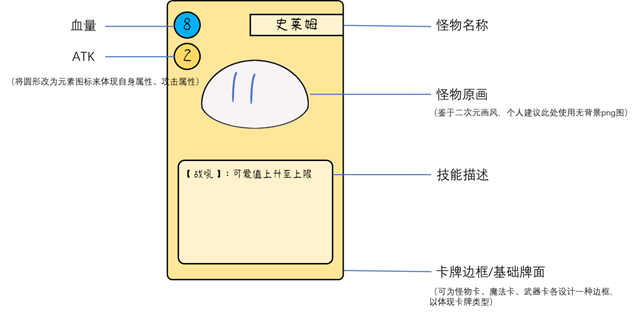
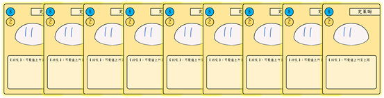
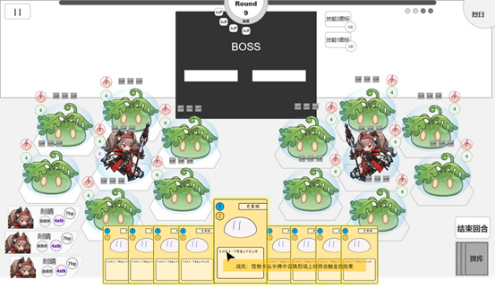
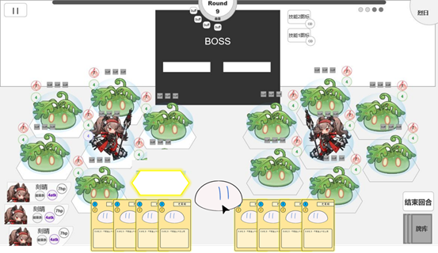

# 2.卡牌

> 参照需求文档
>
> - [怪物卡相关需求](https://www.teambition.com/project/61a89798beaeab07a42c799c/works/61c5cc58f516a2003f0cd9c4/work/61d1598a9a6b6f003fdf2973)
> - [手牌-发牌、出牌、弃牌](https://www.teambition.com/project/61a89798beaeab07a42c799c/works/61c5cc58f516a2003f0cd9c4/work/61cca0706eb9a5003fe3eb3a)
>
> 整理，最终解释权归原文档所有

# 逻辑部分

　　储存玩家须知的卡牌作用与信息

　　作为单位召唤的信息媒介

　　

# 显示&交互部分

## UI 布局（怪物卡为例）

　　

### 二级面板

　　（暂不为卡牌设计二级面板）

## 操作响应

### 可使用高亮（低优先）

　　（暂时不存在不可使用情况）

　　进入玩家回合时，可用卡牌**边缘高亮**

　　

### 悬停

* 当鼠标指针悬停在怪物卡上时，怪物卡上浮前置并放大，此时鼠标指针可以移至卡面上的关键词处，以查看其具体解释信息。
* 鼠标移出怪物卡区域则该卡收回。

　　

### 单位召唤

　　当单击怪物卡时，进入 `怪物放置状态`，该卡变为跟随光标的怪物 png 图片，场上可放置的地格 `边缘高亮`（详见场地）

　　

### 魔法使用

　　选取过程中从选中卡牌出现一条跟随鼠标移动的箭头，鼠标隐藏，进入目标选取状态

* 从选中单位头上开始出现一条跟随鼠标移动的箭头，鼠标隐藏
* 任意位置点击右键取消，非有效区域再次点击左键（或者拖拽过程中松开左键）同样取消选取状态，取消后箭头消失，鼠标出现
* 可执行单位地块边缘高亮（见场地）
* 当鼠标悬浮在可受击敌方单位上时，目标头顶出现 **选中标记，** 选中标记应在垂直范围内上下浮动

　　在可执行单位上 `单击鼠标左键`——完成选取操作

　　

# 细分需求列表

* [ ] 实现卡牌类
  * [ ] 实现不同卡牌区别
  * [ ] 实现卡牌信息导入
* [ ] 实现卡牌 UI 显示脚本
  * [ ] 显示卡牌信息
  * [ ] 读取卡牌图片
* [ ] 实现卡牌战斗 UI 交互脚本
  * [ ] 实现出牌
  * [ ] 实现可选中高亮
