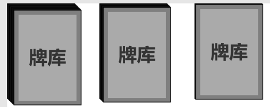

# 3.牌库

> 参照需求文档
>
> - [牌库UI需求文档](https://www.teambition.com/project/61a89798beaeab07a42c799c/works/61c5cc58f516a2003f0cd9c4/work/61d94a495d25f1003f1aa8dd)
>
> 整理，最终解释权归原文档所有

# 逻辑部分

　　牌库储存对局外传入的玩家牌组信息，实现洗牌、发牌与余牌统计

# 显示&交互部分

　　牌库有层叠的视觉效果，随着抽牌，UI 的层叠效果需要与当前剩余牌数量保持一致，抽完最后一张 **特殊显示** （特殊显示效果待议）

　　

## 一级面板

* 显示牌库基本厚度

## 二级面板

　　在鼠标悬浮牌库区域 0.5s 后显示

* 显示卡牌余量

# 细分需求列表

* [ ] 实现牌库类
  * [ ] 实现卡牌周转（手牌、牌堆、墓地）
  * [ ] 实现洗牌功能
  * [ ] 实现发牌功能
  * [ ] 实现角色发牌
* [ ] 实现牌库 UI 显示脚本
  * [ ] 读取牌库余牌数量
  * [ ] 厚度显示
  * [ ] 实现牌库详情唤起
