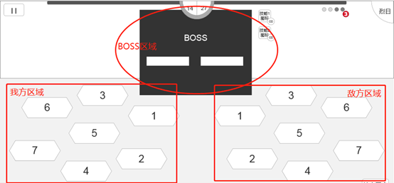
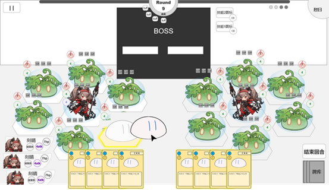

# 4.场地

> 参照需求文档
>
> - [场地信息&地块&嘲讽](https://www.teambition.com/project/61a89798beaeab07a42c799c/works/61c5cc58f516a2003f0cd9c4/work/61d96d961824ff003fdfe532)
>
> 整理，最终解释权归原文档所有

　　场地阵营可分为 3 方，分别为：

　　——我方区域：我方（玩家 1）召唤角色/怪物&发起进攻的区域

　　——敌方区域：敌方（电脑/玩家 2）召唤角色/怪物&发起进攻的区域

　　——BOSS 区域：BOSS（电脑）所在区域

　　

　　场地中的不同地块具有不同的编号及特性，Boss 选取攻击目标时会依据地块排序进行攻击（详见 Boss/技能释放）

# 逻辑部分

## 地块

　　场地中的地块具有固定编号，不同地块具有不同特性及限制

### 地块特性

* 嘲讽/前排地块：1、2 号地块存在部署单位时，敌方 `近战单位` 普通攻击仅可攻击 1、2 地块上的单位
* 角色地块：5 号地块仅可部署角色

### 地块相邻

　　我方、敌方地块均有 7 格，地块具有**相邻**概念：

* 1 的相邻格为：2 3 5
* 2 的相邻格为：1 4 5
* 3 的相邻格为：1 5 6
* 4 的相邻格为：2 5 7
* 5 的相邻格为：1 2 3 4 6 7
* 6 的相邻格为：3 5 7
* 7 的相邻格为：4 5 6

　　地块相邻主要服务于 AOE

## 攻击高亮逻辑

　　高亮被选取单位可攻击的单位脚下地块

* 目标没有无法被选中等特效
* 目标可攻击到
  * 目标为前排
  * 目标在后排但无前排阻挡
  * 目标为 Boss
  * 进攻单位为远程单位

## 召唤高亮逻辑

　　高亮当前未被占用的召唤方怪物场地

# 显示&交互部分

　　地块在正常状态下不显示，仅某些情况下才会出现边框高亮或者整体高亮。

## 召唤显示

　　当玩家发起召唤请求（点击怪物卡）时，所有当前可部署怪物的地块进行 `边缘高亮`

　　

　　当光标移至某一地格上或其附近时，该地格 `整体高亮` 并且怪物吸附至该位置呈现半透明状（以提示玩家其所选择的地格），可以通过再次单击将该怪物放置于该地格。

　　

## 攻击显示

　　当玩家发起进攻/施法请求（点击单位、点击魔法卡、点击技能释放）时，所有可攻击的单位脚下地块高亮

　　（注意部分攻击请求受到前排 `嘲讽` 限制）

　　

# 细分需求列表

* [ ] 实现格子类
  * [ ] 实现格子属性创建
  * [ ] 实现格子绑定场地
  * [ ] 实现格子绑定单位
* [ ] 实现格子 UI 显示类
  * [ ] 实现场景中格子 UI 创建
  * [ ] 实现面对不同需求高亮
  * [ ] 实现召唤时被选中为目标位置
* [ ] 实现场地类
  * [ ] 实现对场地中格子的管理
  * [ ] 实现对格子 UI 更新的管理
  * [ ] 实现攻击高亮格子检测逻辑
  * [ ] 实现召唤高亮格子检测逻辑
