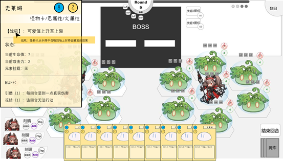

# 5.1.单位

> 参照需求文档
>
> - [选取与被选取需求文档](https://www.teambition.com/project/61a89798beaeab07a42c799c/works/61c5cc58f516a2003f0cd9c4/work/61d99e47517a81003fd02bdc)
> - [攻击&反击需求文档](https://www.teambition.com/project/61a89798beaeab07a42c799c/works/61c5cc58f516a2003f0cd9c4/work/61daa28b9ffc95003f1a732e)
> - [受击需求文档](https://www.teambition.com/project/61a89798beaeab07a42c799c/works/61c5cc58f516a2003f0cd9c4/work/61daa290262e36003fb2dd90)
> - [二级菜单相关需求](https://www.teambition.com/project/61a89798beaeab07a42c799c/works/61c5cc58f516a2003f0cd9c4/work/61d854f2a2182f003f2005c9)
>
> 整理，最终解释权归原文档所有

　　单位类储存场上作战单位基础信息，并实现基本作战功能

# 逻辑部分

## 单位召唤

　　见卡牌操作响应

## 单位攻击

　　单位攻击流程分为以下阶段

* 选取攻击单位（确定己方可被选取单位
* 选取受击单位（确定敌方可被攻击单位
* 播放攻击动画
  * 前进/闪现
  * 攻击/受击动作
  * 反击/受击动作
  * 后退/闪现

### 确定可被进攻选取

　　选中条件：

* 己方回合中
* 单位有剩余行动次数
  * 非当前回合上场
  * 本回合尚未攻击
  * 未受限制类 Buff

### 确定可被受击选取

　　选中条件：

* 目标没有无法被选中等特效
* 目标可攻击到
  * 目标为前排
  * 目标在后排但无前排阻挡
  * 目标为 Boss
  * 进攻单位为远程单位

### 单位反击

　　单位标准攻击流程中，若符合以下情景则触发单位反击

* 受到近战单位攻击
* 受击单位行动未受限（冰冻/感电 Buff

## 单位受击

　　单位受击事件由以下条件触发

* 单位遭到单位攻击/反击
* 单位受到魔法卡攻击
* 单位受到技能（角色/Boss）攻击
* 单位 Buff 结算产生伤害
* 单位受到剧变反应伤害

　　（将可触发受击的事件统一封装，见 `伤害结算`）

　　受击过程中进行伤害结算，并播放动画/更新 UI

　　若单位 `受到致命伤害` 则触发单位死亡事件

* 怪物死亡，无特殊事件
* 角色死亡，触发 `角色上场` / `游戏结束`
* BOSS 死亡，触发 `游戏结束`

# 显示&交互部分

　　单位显示部分要求传达单位于玩家作战有用的信息，并实现基本的交互

## 单位 UI

### 攻击区

* 显示单位攻击力
* 显示单位攻击属性图标

### 血量区

* 显示单位血量
* 显示单位护盾效果

### Buff 区

　　

　　Buff 区位于单位 UI 顶部，常态时隐藏

* 显示 Buff 图标
* 对于含层数 Buff —— 如护甲、引燃等，在图标中心加入层数标记

#### Buff 二级面板

　　鼠标悬浮（0.5 秒）：显示该 buff 的具体描述信息。

　　示意图如下

　　

## 单位交互

### 召唤交互

* 播放召唤动画

### 攻击交互

　　攻击交互分为以下三个步骤

* 选取攻击单位（确定己方可被选取单位
* 选取受击单位（确定敌方可被攻击单位
* 播放攻击动画

#### 选取攻击单位

　　可进行攻击单位（见逻辑部分）在回合开始时高亮（见场地），鼠标单击选中，进入受击目标选取状态

#### 选取受击单位

　　受击目标选取状态：

* 从选中单位头上开始出现一条跟随鼠标移动的箭头，鼠标隐藏
* 任意位置点击右键取消，非有效区域再次点击左键（或者拖拽过程中松开左键）同样取消选取状态，取消后箭头消失，鼠标出现
* 可受击敌方单位（见逻辑部分）地块边缘高亮（见场地）
* 当鼠标悬浮在可受击敌方单位上时，目标头顶出现 **选中标记，** 选中标记应在垂直范围内上下浮动

　　

　　在可受击敌方单位上 `单击鼠标左键`——完成选取操作，发起进攻

### 受击交互

* 播放受击动画
* 显示受伤数字（大小/元素类型）

### 单位死亡

* 播放死亡动画

## 单位二级面板

* 显示逻辑：鼠标在 [ 角色名片、场上角色、场上怪物、Boss ] `悬停 0.5s` 时，需要弹出其对应二级菜单
* 显示位置：所有二级菜单均在界面左上角（菜单左上角为其原点），且同时只会出现一个二级菜单
* 关闭逻辑：二级菜单弹出后，`移开鼠标至其他区域 0.5s` 或 `任意位置右击鼠标` 或 `通过左击鼠标进行任何有效操作（如卡牌选中、怪物攻击）` 时，该二级菜单关闭。
  注：进入攻击目标选取状态后仍可以通过在目标上悬停来唤起二级菜单。

　　

> 疑议：场上可召唤二级面板位置占比过大，是否影响玩家游戏体验？
>

### 提示文字（低优先）

　　二级菜单弹出后，可将鼠标移至某些关键词处悬停，浮现一行详细说明文字。移开鼠标则该说明文字消失。

　　

> 该操作逻辑是否存在矛盾，如查看对手信息时，0.5s 内将鼠标移回二级面板
>

　　

# 细分需求列表

* [ ] 实现单位类
  * [ ] 实现单位创建及基本战斗属性
  * [ ] 实现单位回合行动属性
  * [ ] 实现单位承伤功能
  * [ ] 实现单位 Buff 承载
  * [ ] 实现单位特性接口（非当前版本）
  * [ ] 实现单位攻击接口（实现攻击管理器
* [ ] 实现单位 UI 显示脚本
  * [ ] 根据单位当前攻击/攻击元素显示
  * [ ] 根据单位当前血量/护盾显示
  * [ ] 根据单位当前附加 Buff 显示
  * [ ] 实现单位二级面板显示接口（悬浮）
* [ ] 实现单位战斗 UI 交互脚本
  * [ ] 实现单位攻击被选中
  * [ ] 实现单位受击被选中
* [ ] 实现单位二级面板 UI 显示脚本
  * [ ] 获取指定单位数据
  * [ ] 解析单位数据并提示
  * [ ] 实现文本超链接文字提示（低优先）
* [ ] 实现选择箭头 UI 脚本（非单位需求
* [ ] 实现攻击管理器（非单位需求

　　
