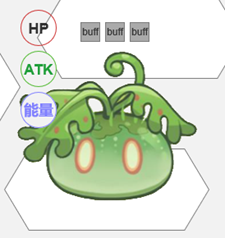
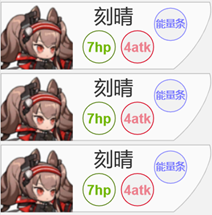

# 5.2.角色

> 参照需求文档
>
> - [角色技能&出场技能](https://www.teambition.com/project/61a89798beaeab07a42c799c/works/61c5cc58f516a2003f0cd9c4/work/61d54e0edd5a93003fc68f40)
> - [角色名片交互&出场下场](https://www.teambition.com/project/61a89798beaeab07a42c799c/works/61c5cc58f516a2003f0cd9c4/work/61c9857eb079f7003fca4c72)
> - 
>
> 整理，最终解释权归原文档所有

> 角色面板的交互/出招交互是否需要调整
>
> 以明日方舟的单位形式进行简并？
>
> CHECK：角色名片交互&角色出场与下场
>

　　角色作为一种特殊的单位，具有以下特性

* 拥有技能组及其耗能属性
* 角色力竭与游戏胜负挂钩
* 除游戏开始时，强制要求角色驻场

# 逻辑部分

## 技能

### 技能充能

* 角色主动技能需要足够的元素充能才能释放
* 每名角色储存的能量具有上限，统一为 4 点
* 对于驻场角色，“玩家回合前”阶段时自动增加一点能量

### 技能释放

#### 主动技能释放

　　释放条件：角色当前充能量满足主动技能释放需求

* 释放主动技能时，消耗角色对应能量值。
* 释放交互见 `UI 显示&交互`

#### 出场技能释放

　　释放条件：

* 玩家召唤一名角色到场上后，释放出场技
* 角色被自动替换到场上后，释放出场技

　　角色每次上场都可释放出场技能

## 角色更换

　　

## 角色力竭

　　

# 显示&交互部分

## 单位 UI

　　角色 UI 显示与单位基本相同，唯一区别在于补充了角色能量区域

　　

　　能量区域更新角色当前充能状态，当角色的能量值满足释放必杀的条件时，能量图标将高亮显示。

　　在“玩家回合中”阶段，`点击` 高亮的能量图标，可以释放角色主动技能

* 如果该技能无需指定目标，则点击直接释放技能
* 如果该技能需要指定目标，则进入攻击选择事件

## 角色名片

　　角色名片区由三个自定顺序排列的角色名片组成

　　

* 角色区中的角色名片自动向下对齐。
* 新加入的角色位于角色区的最上方。

### 面板显示

* 显示后台角色三维信息（血量攻击充能
* 显示后台角色标识信息（名称证件照

### 面板交互

* 当鼠标指针悬停在对应的角色名片上时，角色名片出现描边/高亮
* 鼠标长按并拖动，调整角色名片排序
  * 角色名片排序影响到角色死亡时自动上场替换角色
  * 拖动时名片跟随鼠标移动
  * 将名片拖动至其它名片的上方或者下方时松开鼠标左键，则角色名片会回到名片区并被设置在其他名片的上方或者下方，达到自定义排序
* 鼠标单击时进入召唤流程，选定角色位时实现召唤
  * 若开发损耗较高可考虑点击直接更换角色

# 细分需求列表

* [ ] 实现角色类
  * [ ] 继承单位类并扩充特性
  * [ ] 实现“玩家回合前”阶段充能
  * [ ] 实现技能释放
    * [ ] 实现目标选择和获取
    * [ ] 实现技能类
  * [ ] 实现角色死亡时消息
    * [ ] （游戏上下文实现角色更替）
  * [ ] 实现角色后台信息保存
* [ ] 实现角色 UI 显示
  * [ ] 继承单位 UI 显示，扩充能量
  * [ ] 实现能量模块点击交互
* [ ] 实现角色面板 UI 显示
  * [ ] 实现读取后台角色信息
  * [ ] 实现拖动排序
  * [ ] 实现点击召唤
  * [ ] 实现单位二级面板显示接口（悬浮）
