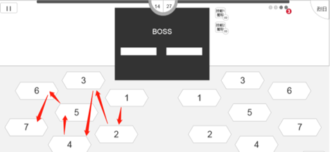
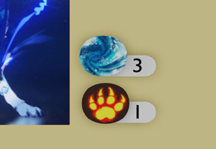
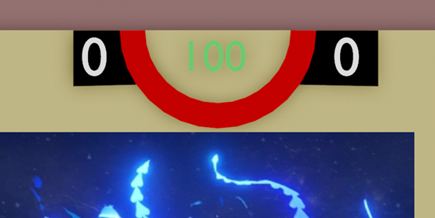
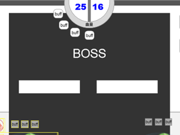

# 5.3.Boss

> 参照需求文档
>
> - [计分框与Boss血量显示需求](https://www.teambition.com/project/61a89798beaeab07a42c799c/works/61c5cc58f516a2003f0cd9c4/work/61da99b2ed5c4a003f8db86f)
> - [伤害Boss计分需求文档](https://www.teambition.com/project/61a89798beaeab07a42c799c/works/61c5cc58f516a2003f0cd9c4/work/61daa9040e16ec003f0b7609)
> - [Boss技能UI设计需求](https://www.teambition.com/project/61a89798beaeab07a42c799c/works/61c5cc58f516a2003f0cd9c4/work/61da99acc51bb0003f7096d9)
> - [Boss技能的释放与技能CD](https://www.teambition.com/project/61a89798beaeab07a42c799c/works/61c5cc58f516a2003f0cd9c4/work/61d97da5e8d5a0003fbaa446)
>
> 整理，最终解释权归原文档所有

　　Boss 作为一种特殊单位，具有以下特性

* Boss 不具备攻击力
* Boss 不可进行反击（或执行反击流程但伤害为 0）
* Boss 拥有两个可充能的主动技能
* Boss 血量变动影响计分

# 逻辑部分

## 技能

### 技能充能

* 当前版本的设计中，每个 Boss 拥有两个技能，每个技能拥有独立的充能要求/上限。
* 游戏开始时，各技能充能为 `初始值` ，随后每当回合进行到“Boss 回合前”时，其充能值自动增加。
* 在“Boss 回合中”阶段，Boss 将释放已达到充能要求/上限的技能。
* 注：当 Boss 处于被控制状态时充能获取照常。

### 技能释放

* 在“Boss 回合中”阶段，如果 Boss 未受到控制，将释放已达到充能要求/上限的技能（若无法行动则自动跳过阶段）
* 技能目标选取：
  * Boss 技能目标可为 `对单体释放`、`对群体释放` 及 `对自身释放`。
  * 对单体释放技能规则如下：
    * 单体技能仅对 `上回合活动玩家` 方进行释放
    * 单体技能的释放具有特定优先级顺序，暨玩家战场上地块编号顺序，见下图

　　

# 显示&交互部分

## 技能显示

### 一级面板

　　一级面板位于主 UI 中，主要需求为

* 展示技能图标
* 展示技能充能

　　

　　（待确定一级面板是否以数值形式显示充能要求/上限，还可通过亮星、进度条等形式）

### 二级面板

　　#待需求#

　　鼠标悬浮于技能图标处显示

* 描述技能详细效果

## 血量显示（计分框）

　　计分框是原牌判定胜负的核心机制之一，与玩家对 Boss 的攻击紧密相关

　　

　　

　　计分框由两个部分组成——Boss 血量，玩家积分

　　中心显示 Boss 剩余血量，两侧更新玩家对 Boss 造成伤害的计分，及其他奖励计分

### 更新逻辑

　　当玩家对 boss 造成 `一定伤害` 时：

* Boss 血量条从两端对称减少（待定）
* 对应玩家分数上升对应伤害
* 对应玩家计分条增长

　　特殊：注意记录引燃 Buff 来源进行计分（引燃为真实伤害无视护盾护甲）

　　更新动画：待美术设计

### 一级面板

　　一级面板位于主 UI 中

* 显示 Boss 血量、玩家积分数值
* 显示进度条

### 二级面板

　　#待需求#

　　鼠标悬浮于计分框处显示

* 显示详细积分 Logs（包括奖励积分文案）

## Buff 栏

　　由于 Boss 同其他单位 UI 显示形式不同，Buff 及其他信息在计分框周围排列

　　参考图如下，具体需求基于标准 Buff 需求

　　

* （特殊）Boss 元素附着状态在 Buff 栏上表现
* （特殊）Boss 护盾状态在 Buff 栏上表现

# 细分需求列表

* [ ] 实现 Boss 类
  * [ ] 继承单位类并扩充特性
  * [ ] 实现“Boss 回合前”阶段充能
  * [ ] 实现 Boss 血量变动/死亡消息（受流程类阻滞）
  * [ ] 实现技能释放
    * [ ] 实现目标选择和获取
    * [ ] 实现技能类
* [ ] 实现技能 UI 显示脚本
  * [ ] 获取 Boss 对应技能贴图
  * [ ] 获取并更新 Boss 充能状态
* [ ] 实现计分框 UI 显示脚本
  * [ ] 接收特定玩家对 Boss 造成具体伤害消息，并更新显示
  * [ ] 接收特定玩家奖励积分消息，并更新显示
* [ ] 实现 Boss 信息显示脚本（与计分框联动）
  * [ ] 在计分框周围排列当前 Buff（* 包括元素 Buff

　　
