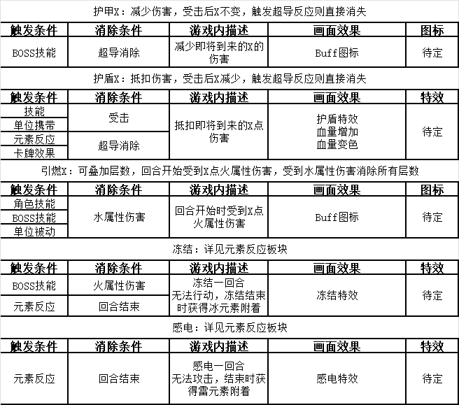

# 6.Buff

> 参照需求文档
>
> - [元素附着需求](https://www.teambition.com/project/61a89798beaeab07a42c799c/works/61c5cc58f516a2003f0cd9c4/work/61cb33851afcb1003f9904e2)
> - [元素反应需求](https://www.teambition.com/project/61a89798beaeab07a42c799c/works/61c5cc58f516a2003f0cd9c4/work/61cb33851afcb1003f9904e3)
> - [Buff附加&消除&效果需求](https://www.teambition.com/project/61a89798beaeab07a42c799c/works/61c5cc58f516a2003f0cd9c4/work/61d966026452a8003fd609a5)
>
> 整理，最终解释权归原文档所有

# 逻辑部分

## 元素 Buff 

　　元素反应作为 Buff 在框架中参与结算

　　相关需求详见：

　　[元素附着需求](https://www.teambition.com/project/61a89798beaeab07a42c799c/works/61c5cc58f516a2003f0cd9c4/work/61cb33851afcb1003f9904e2)

　　[元素反应需求](https://www.teambition.com/project/61a89798beaeab07a42c799c/works/61c5cc58f516a2003f0cd9c4/work/61cb33851afcb1003f9904e3)

## 普通 Buff 

　　

　　PS：触发条件和消除条件相互独立，这表格不够清晰

# 显示&交互部分

## Buff 图标

　　buff 图标及其显示从属于单位 UI

# 细分需求列表

* [ ] 实现 Buff 基类
  * [ ] 确定 Buff 需要属性
  * [ ] 确定 Buff 读取接口
  * [ ] 实现 Buff 单位联动
* [ ] 实现具体 Buff
  * [ ] 护甲
  * [ ] 护盾
  * [ ] 引燃
  * [ ] 冻结
  * [ ] 感电
* [ ] 实现元素 Buff
  * [ ] 确认元素反应逻辑
  * [ ] ··
